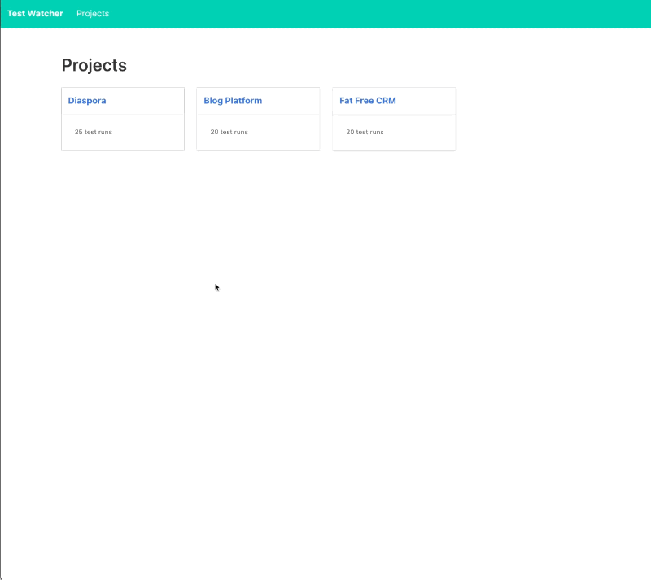

# Test Watcher

Test Watcher is a tool that offers interactive reporting for automated test runs. It integrates into test running pipeline through a custom [Cucumber formatter](./lib/test_watcher_formatter.rb), delivering real-time progress updates for test cases, even during parallel test execution. Test Watcher also maintains a history of test runs and provides a visual display of passed and failed tests over time.

## Features

- **Interactive reporting**: Get real-time updates on your test cases as they run.
- **Test history**: Keeps a history of all test runs for easy reference.
- **Visual display**: Shows a chart of passed and failed tests over time to easily track progress.
- **Seamless integration**: Works with Cucumber through a custom formatter.
- **Parallel test execution support**: Stay updated even when running tests in parallel.
- **Expandable**: Can be adapted to work with other testing frameworks.



## Integration

### Cucumber

1. Add [Cucumber formatter](./lib/test_watcher_formatter.rb) to your project.
2. To use Test Watcher with Cucumber, you need to add the following to your `cucumber.yml` file:
   ```yaml
   default: --format TestWatcherFormatter --out /dev/null
   ```

## Developer's Note

Test Watcher was rapidly developed as a self-educational tool, to address specific needs at work, and for enjoyment. It has served my team effectively despite not having extensive code refinement or complete test coverage. Please view this project as a practical tool with room for growth and improvement. Your feedback and contributions are welcomed.
